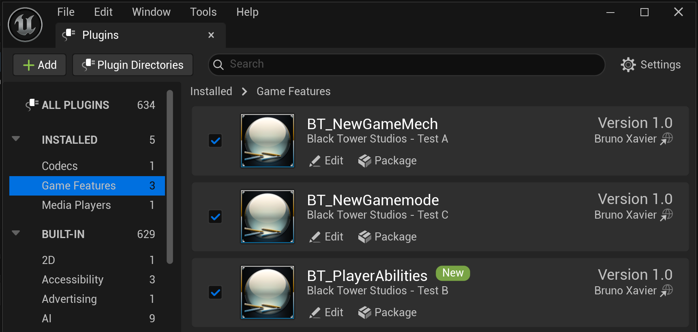

> Template taken from Unreal Engine "5.4.2 Release". 
> Project build on Unreal Engine "5.5.0 Preview".
 

>> [**BASE CONTROLS**] 
> * AWSD - Move / Walk
> * SPACEBAR - Jump
> * LMB - Shoot

>> [**JETPACK CONTROLS**] 
> * AWSD - Move / Fly
> * SPACEBAR - Thrust / Shut off

 

    

